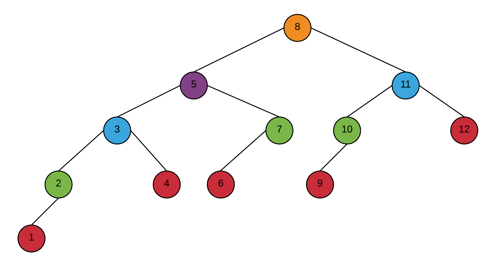
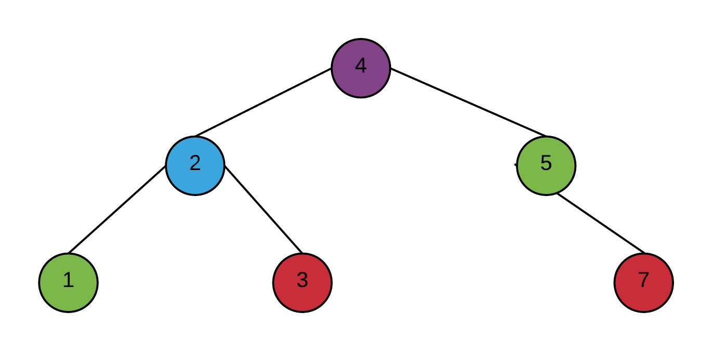
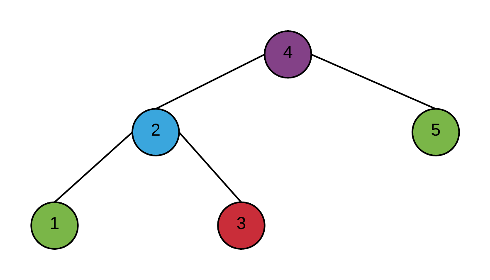

# 2 Arbres binaires de recherche

## 2.1 Arbre AVL

```cpp
template <class T>
bool ArbreAVL<T>::operator == (const ArbreAVL& autre) const {
  return egal(racine, autre.racine);
}

template <class T>
bool ArbreAVL<T>::egal(Noeud* n1, Noeud* n2) const {
  if (n1 == nullptr && n2 == nullptr)
    return true;
  if (n1 != nullptr && n2 != nullptr && n1->element == n2->element)
    return egal(n1->gauche, n2->gauche) && egal(n1->droite, n2->droite);
  return false;
}
```

[Référence](https://www.geeksforgeeks.org/write-c-code-to-determine-if-two-trees-are-identical/)

## 2.2 Arbre AVL minimal

suite de Fibonnaci

où n = nombre de noeuds

et h = hauteur de l'arbre

```
n(h) = {
  0 si h = 0
  1 si h = 1
  n(h - 1) + n(h - 2) + 1 si h >= 2
}
```

n(0) = 0

n(1) = 1

n(2) = n(1) + n(0) + 1 = 2

n(3) = n(2) + n(1) + 1 = 4

n(4) = n(3) + n(2) + 1 = 7

n(5) = n(4) + n(3) + 1 = 12



## 2.3 Insertion



## 2.4 Suppression



## 2.5 Trouver les erreurs

```cpp
template <class T>
class ArbreAVL{
  public:
    //...
    T minimum() const {
      if (racine == NULL) {
        return 0;
      }
      return minimum(racine);
    }
    private:
      T minimum(Noeud∗ n) const {
        if (n−>gauche == NULL)
          return n−>element;
        return minimum(n−>gauche);
      }
      //...
    };
    int main() {
      ArbreAVL<int> a;
      for (int i = 0; i < 10; i++)
        a.inserer(i);
      int& m = a.minimum();
      m += 10;
      std::cout << " m = " << m << std::endl;
    }
```

* vérifier si la racine est null
* il manque l'accolade fermante pour la méthode T& minimum(Noeud∗ n);
* ne pas retourner une référence et...
* utiliser le mot clé const pour ne pas modifier le contenu de l'arbre

## 2.6 Minimum et maximum dans un Arbre-B

* minimum : O(log n)
* maximum : O(log n)
