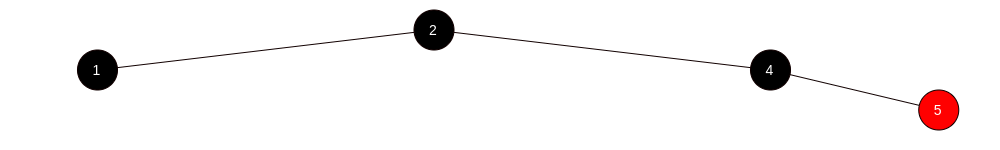
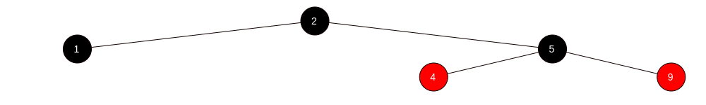
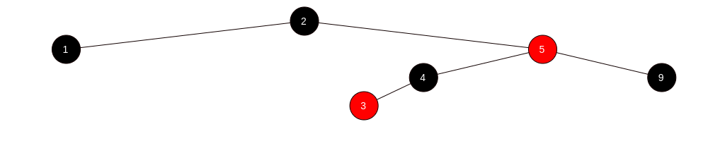
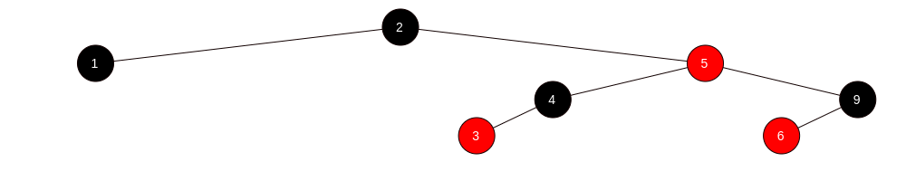
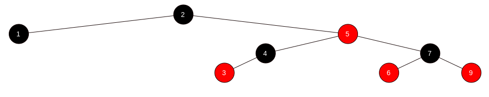

# Arbre rouge-noir - Insertion

Insérer 2, 1, 4, 5, 9, 3, 6, 7 dans un arbre rouge-noir.

## Insérer 2 - Cas 1

## Insérer 1 - Cas 2

## Insérer 4 - Cas 2

## Insérer 5 - Cas 3 + Cas 2

## Insérer 9 - Cas 4.2

## Insérer 3 - Cas 3 + Cas 2

## Insérer 6 - Cas 2

## Insérer 7 - Cas 4.1 + Cas 4.2

