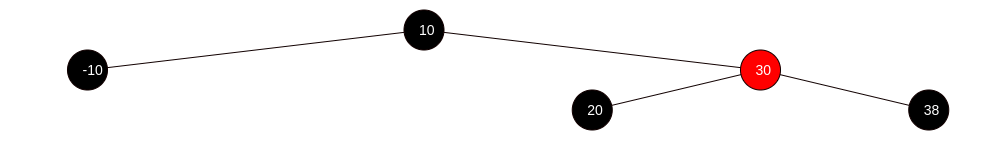
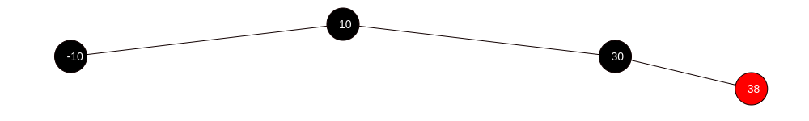
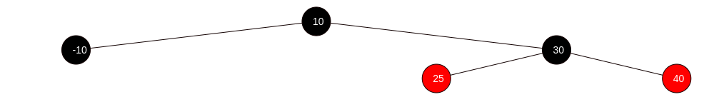
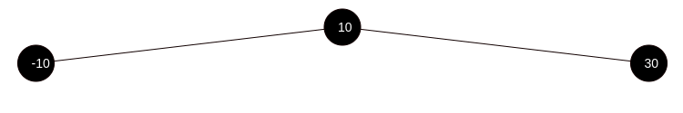
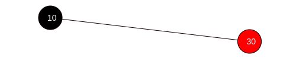
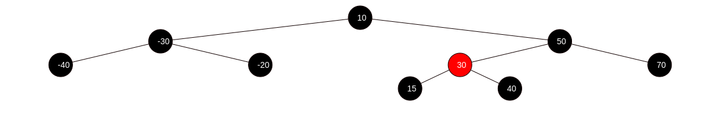
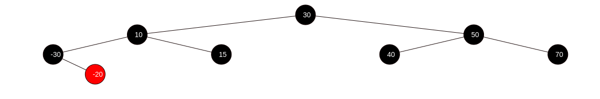
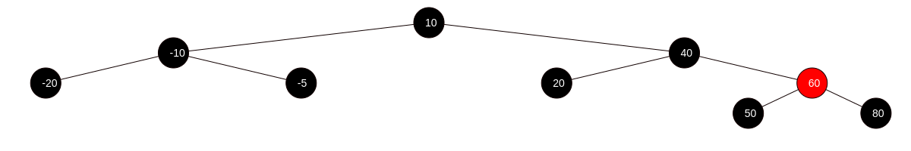
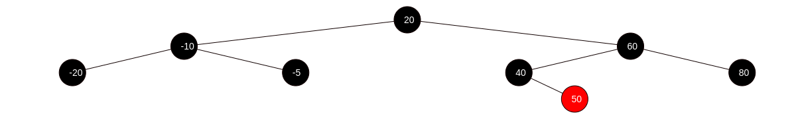

# Arbre rouge-noir - Suppression

## Cas 4
Supprimer 20 de l'arbre rouge-noir suivant.

**Avant**

**Après**

## Cas 6
Supprimer -10 de l'arbre rouge-noir suivant.

**Avant**

**Après**

## Cas 3 + Cas 1
Supprimer -10 de l'arbre rouge-noir suivant.

**Avant**

**Après**

## Cas 3 + Cas 5 + Cas 6
Supprimer -40 de l'arbre rouge-noir suivant.

**Avant**

**Après**

## Cas 2 + Cas 4
Supprimer 10 de l'arbre rouge-noir suivant en utilisant le sucesseur comme remplaçant.

**Avant**

**Après**

